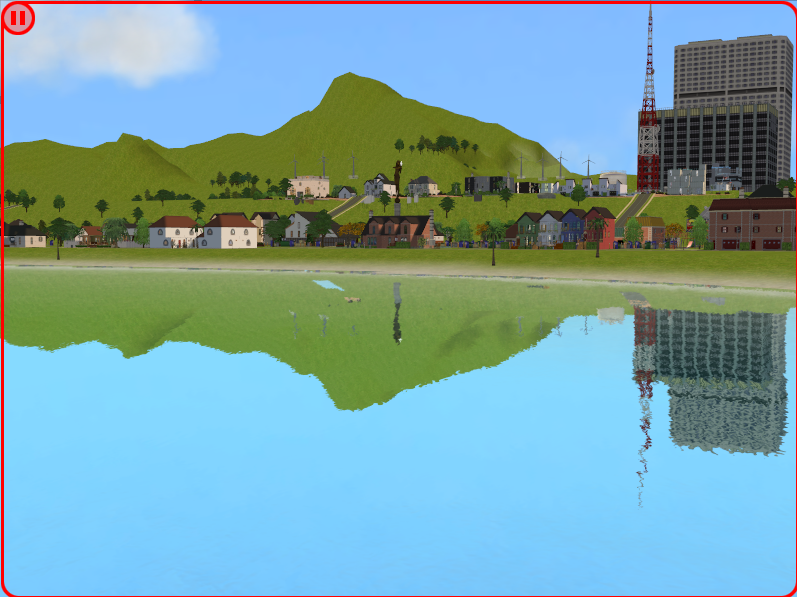
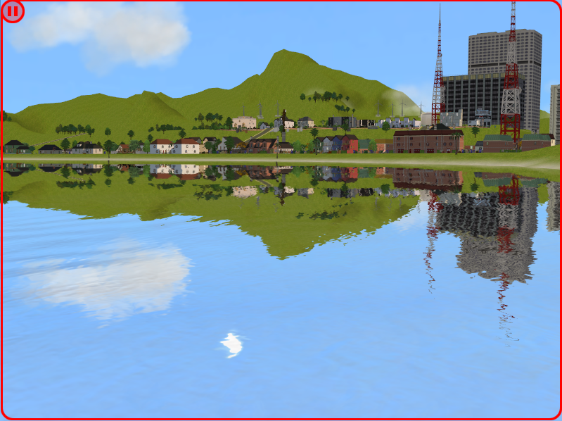
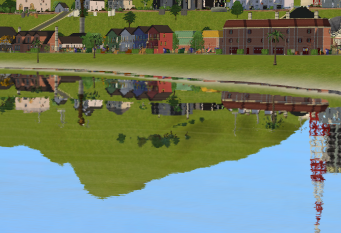
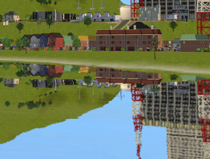
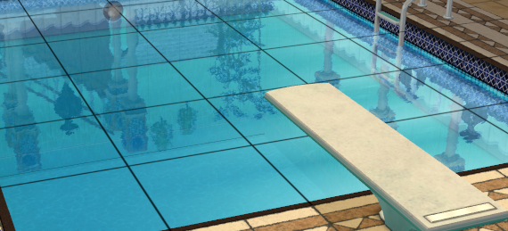
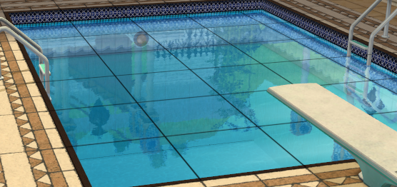
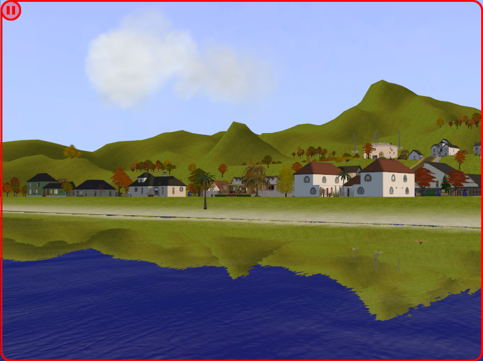
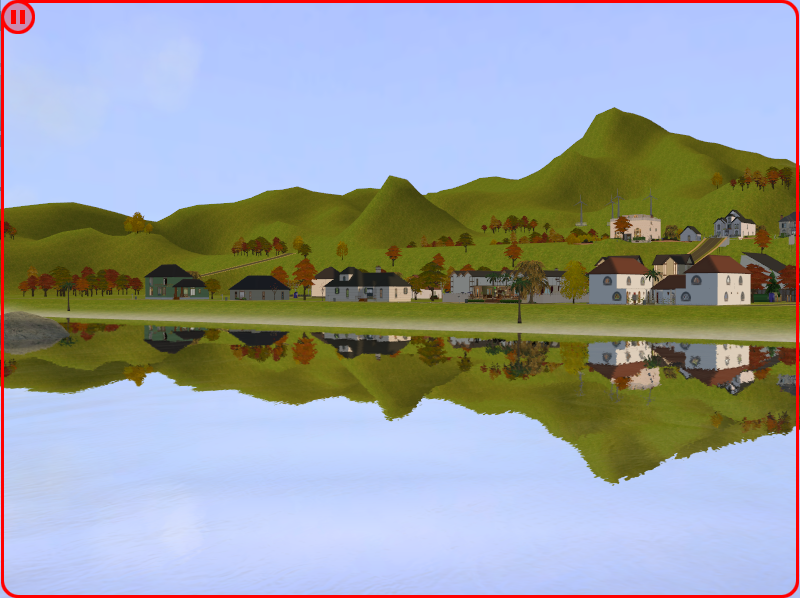

# TS2 Reflective Water
## About
A patch for The Sims 2 that improves ocean reflections in lot view, inspired by the reflections seen in Castaway Stories.

Made for use with The Sims 2: Ultimate Collection, using either [Sims2RPC](https://modthesims.info/d/648220/sims2rpc-modded-sims-2-launcher-for-mansion-and-garden.html)
or [Ultimate ASI Loader](https://github.com/ThirteenAG/Ultimate-ASI-Loader).

## Features
### Lot Ocean Reflections
Hardware compatibility checks for enabling ocean reflections in lot view seem to be slightly broken when playing on modern setups, as ocean reflections are always
forced off. This patch changes these checks to always succeed, so ocean reflections are forced on instead.

[Sims2RPC](https://modthesims.info/d/648220/sims2rpc-modded-sims-2-launcher-for-mansion-and-garden.html) already has an option for this, but since some people play
without it, it was important to also include this functionality here. My method for enabling lot reflections differs from RPC's, so it's not a direct copy.

**Note for Sims2RPC users:** This patch will make RPC's option to enable/disable lot ocean reflections have no effect (as in, lot ocean reflections will still be
enabled even with the setting disabled in the RPC launcher).

### Full Scene Reflections
By default, Sims 2 only permits objects internally flagged as both `"VisibleInWaterReflection"` and `"Props"` to reflect in water. This is rather limited, as only large
neighbourhood decorations will be reflected, excluding important scenery such as houses, roads, and trees. These restrictions have been lifted, allowing everything
to be reflected, as well as things like Sims and clouds.

| Vanilla | Mod |
| :-----: | :--: |
|  |  |

**Note on tree reflections:** In order to get trees to reflect, it was necessary to prevent them becoming imposters in lot view (i.e. they're rendered as their full model,
rather than an optimised LOD model). There haven't been any performance concerns noted by those who have tested the mod, but this should still be kept in mind if playing
on weaker hardware.

### Reduced Gap Between Ocean and Terrain
There is a very noticeable gap between the ocean's surface and the landscape in the vanilla game. A minor offset has been added to the height of the reflection plane to
try and reduce this.

This feature is not perfect, as the size of the gap is closely tied to the height of the game's camera &mdash; the greater the distance from the camera's position
to the ocean, the larger the gap. Raising the plane too high causes the reflections to start getting cut off, so a balance was struck between maintaining the full
reflections and reducing the visibility of the gap.

Another small issue is that the increased height of the reflection plane cuts off the reflections of Sims when swimming in the ocean. If this bothers people, I will
look to add a configuration file in a future update that allows for the offset to be adjusted or completely disabled.

| Vanilla | Mod |
| :-----: | :--: |
|  |  |

### Visible Terrain in Pool Reflections
Pool water only reflects objects, not the terrain, so objects appear to be floating in the air when viewed in pool reflections. Pools have been patched to allow
the terrain to be reflected too.

| Vanilla | Mod |
| :-----: | :--: |
|  |  |

### Fixed Seasonal Skybox Reflection Transitions
The lighting manager responsible for updating skybox reflections based on the current season or weather is bugged. It checks for the strings
`"day"` or `"night"` to change the reflection for the correct time of day, except in seasons other than summer, it is instead passed the string of
the season name (e.g. `"winter"`), which causes the skybox visible in the ocean reflection to never update &mdash; this has been fixed.

Instead of checking strings passed to the function, it will instead check internal variables for the time of day, current season, and current precipitation
type to more accurately choose the correct reflection.

| Vanilla | Mod |
| :-----: | :--: |
|  |  |

**Note:** There's a rare chance the lighting manager won't be triggered on a weather change. This means the skybox reflection may get stuck
in the overcast state when the sky is clear and vice versa. The reflection will fix itself the next time the lighting manager is called.

### Castaway Water Shaders
Also included are modified water shaders from Castaway Stories, featuring fancy water movement and the removal of the unnatural cyan tint of the vanilla water.
A version compatible with [dreadpirate's shader fixes](https://www.tumblr.com/dreadpirate/179182314487/blue-snow-no-more-shader-fixes-ive-included) has been
provided, for anyone using that mod.

These shaders are ***completely optional*** and are not required for the plugin to work. This means you can use the plugin with the vanilla water shaders, or
alternative water shaders such as [Voeille's](https://modthesims.info/d/587597/pond-amp-sea-water-overhaul.html), if you prefer the look of those.

## Installation
### Plugin
**For Sims2RPC**

1. Download the plugin found under the [Releases](https://github.com/spockthewok/TS2ReflectiveWater/releases/latest) section of this repository.
2. Move the downloaded plugin to the `\TSBin\mods` directory, found under wherever you have the Sims 2 installed to. For example, on my machine, the plugin would be moved to:

   `E:\Games\The Sims 2\Fun with Pets\SP9\TSBin\mods`

**For Ultimate ASI Loader**

1. Download Ultimate ASI Loader from [here](https://github.com/ThirteenAG/Ultimate-ASI-Loader/releases/download/Win32-latest/dsound-Win32.zip).
2. Extract `dsound.dll` from the zip file and place it in the game's `\TSBin` directory. On my machine, it would go here:

   `E:\Games\The Sims 2\Fun with Pets\SP9\TSBin`
3. Download my [plugin](https://github.com/spockthewok/TS2ReflectiveWater/releases/latest) and move it to the same `\TSBin` directory Ultimate ASI Loader was extracted to.

### Shaders (Optional)
1. Download the zip file found under the [Releases](https://github.com/spockthewok/TS2ReflectiveWater/releases/latest) section of this repository.

2. Extract one of the `.package` files within the zip file to your Sims 2 `\Downloads` directory. Choose the 'dreadpirate' version if you are using
[dreadpirate's shader fixes](https://www.tumblr.com/dreadpirate/179182314487/blue-snow-no-more-shader-fixes-ive-included) and ensure my shaders load last, otherwise use the 'Maxis' version.

## Thanks
[LazyDuchess](https://github.com/LazyDuchess), for the hooking code used in this mod.

[dreadpirate](https://www.tumblr.com/dreadpirate), for their shader fixes mod.
