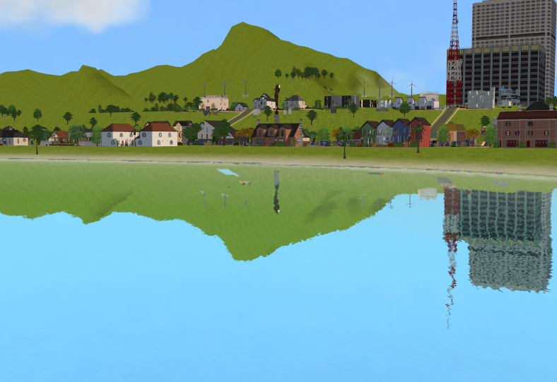
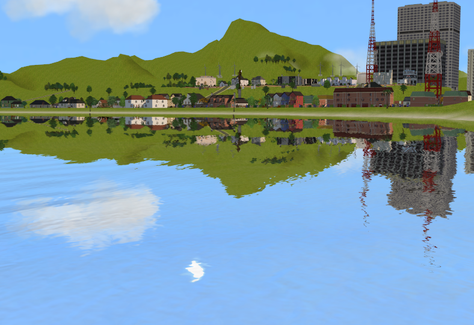
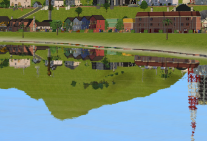
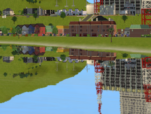
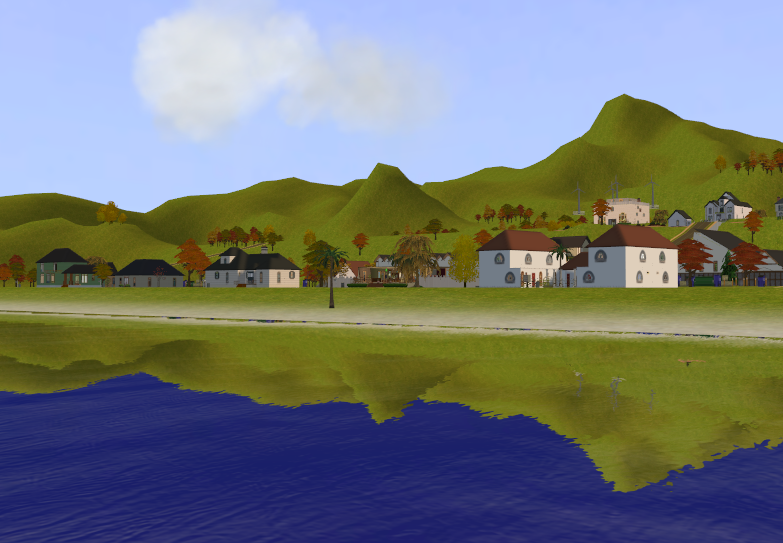
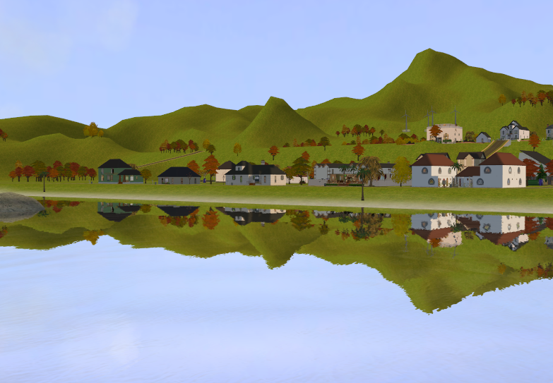
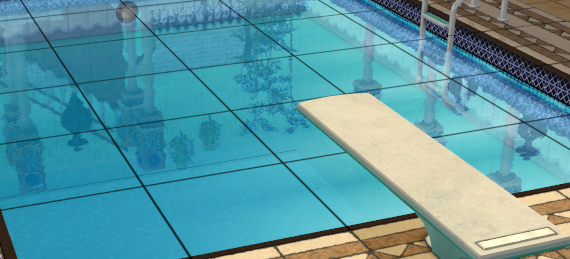
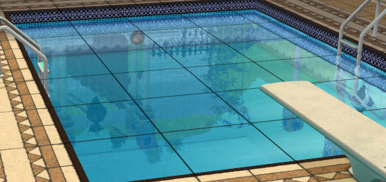
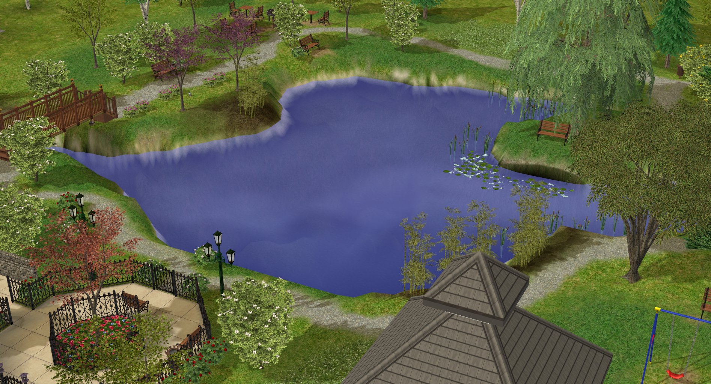
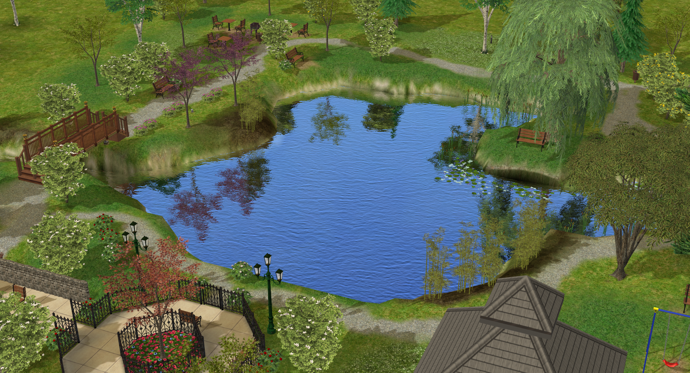

# TS2 Reflective Water
## About
A patch for The Sims 2 that fixes and improves various aspects of water reflections, inspired by the reflections seen in Castaway Stories.

## Requirements
- The Sims 2: Ultimate Collection <ins>**OR**</ins> The Sims 2 disc version with all EPs and SPs.
- [Sims2RPC](https://modthesims.info/d/648220/sims2rpc-modded-sims-2-launcher-for-mansion-and-garden.html) <ins>**OR**</ins>
[Ultimate ASI Loader](https://github.com/ThirteenAG/Ultimate-ASI-Loader).

## Features
### Lot Ocean Reflections
Hardware compatibility checks for enabling ocean reflections in lot view seem to be slightly broken when playing on modern setups, as ocean reflections
are always forced off. This patch changes these checks to always succeed, so ocean reflections are forced on instead.

[Sims2RPC](https://modthesims.info/d/648220/sims2rpc-modded-sims-2-launcher-for-mansion-and-garden.html) already has an option for this, but since some
people play without it, it was important to also include this functionality here. My method for enabling lot reflections differs from RPC's, so it's not
a direct copy.

> [!NOTE]
> If you are using Sims2RPC, this patch will make RPC's option to enable/disable lot ocean reflections have no effect (as in, lot ocean reflections will
> still be enabled even with the setting disabled in the RPC launcher).

### Full Scene Reflections
By default, Sims 2 only permits objects internally flagged as both `"VisibleInWaterReflection"` and `"Props"` to reflect in the lot ocean. This is
rather limited, as only large neighbourhood decorations will be reflected, excluding important scenery such as houses, roads, and trees. These restrictions
have been lifted for both lot view and neighbourhood view, allowing everything to be reflected.

| Vanilla | Mod |
| :-----: | :--: |
|  |  |

### Reduced Gap Between Ocean and Terrain
There is a very noticeable gap between the ocean's surface and the landscape in the vanilla game. A minor offset has been added to the height of the
reflection plane to try and reduce this.

This feature is not perfect, as the gap is actually caused by depth ordering in the game's shaders. Raising the plane too high causes the reflections
to start getting cut off, so a balance was struck between maintaining the full reflections and reducing the visibility of the gap.

Another small issue is that the increased height of the reflection plane cuts off the reflections of Sims when swimming in the ocean. If this bothers you,
this feature can be disabled in the mod's config file &mdash; see the [Configuration](#configuration) section for more information.

| Vanilla | Mod |
| :-----: | :--: |
|  |  |

> [!NOTE]
> It's recommended you disable this feature if you use Christaskyy's [Improved Shaders](https://www.tumblr.com/christaskyy/821768821608169472/ts2-improved-shaders),
> as the depth issues responsible for the gap have been fixed in that mod.

### Fixed Seasonal Skybox Reflection Transitions
The lighting manager responsible for updating skybox reflections based on the current season or weather is bugged. It checks for the strings
`"day"` or `"night"` to change the reflection for the correct time of day, except in seasons other than summer, it is instead passed the string of
the season name (e.g. `"winter"`), which causes the skybox visible in the ocean reflection to never update &mdash; this has been fixed.

Rather than checking strings passed to the function, it will now check internal variables for the time of day, current season, and current precipitation
type to more accurately choose the correct reflection.

| Vanilla | Mod |
| :-----: | :--: |
|  |  |

### Visible Terrain in Pool Reflections
Pool water only reflects objects, not the terrain, so objects appear to be floating in the air when viewed in pool reflections. Pools have been patched
to allow the terrain to be reflected too.

| Vanilla | Mod |
| :-----: | :--: |
|  |  |

### Reflective Pond Water
Ponds are the only large body of water in The Sims 2 that are not reflective whatsoever. Castaway Stories would later modify the game's engine
to add pond reflections, but doing so meant completely overhauling the code for the lot terrain and giving it a dedicated reflection camera &mdash; backporting
this functionality to The Sims 2 would be unfeasible without access to the source code.

Previously, people have tried to add pond reflections by editing the pond water shaders and setting them to use the reflection type of a different
reflective surface, such as swimming pools. The issue with this is that is then necessary to add a swimming pool to the lot for the pond reflections
to work, as they are relying on the swimming pool reflection camera which isn't created until a pool is placed.

This mod solves this by repurposing the unused floor reflection camera that was meant for reflective floors, but was cut from the final game. This
solution is ideal as there will always be a floor present on any lot, meaning the reflection camera will always be active and no objects need
to be placed for the reflections to work.

The pond water shaders from Castaway Stories are included, along with the mirror shaders from [TS2BetaFloors](https://github.com/spockthewok/TS2BetaFloors),
which fix an issue where mirror and pond reflections would fight each other due to them sharing the same reflection type.

| Vanilla | Mod |
| :-----: | :--: |
|  |  |

> [!IMPORTANT]
> Because of the use of the cut floor reflection camera, this feature unfortunately conflicts with the plugin from TS2BetaFloors. Both mods can be used together,
> but this feature will be automatically disabled if this mod detects that TS2BetaFloors is installed.
>
> It's still possible to achieve pond reflections with TS2BetaFloors by installing the pond water shaders from this mod, however the reflections will shift
> up/down when switching between floors on a lot, as a result of how that mod repositions the reflection camera to match the height of the current floor. See
> the [Recommended Mods](#recommended-mods) section for alternative solutions.

### Castaway Ocean Shaders
Also provided are modified shaders from Castaway Stories that alter the appearance of the ocean in lot view.

These ocean shaders are <ins>**completely optional**</ins> and are not required for the plugin to work. This means you can use the plugin with the
vanilla ocean shaders, or alternative ocean shaders such as [Voeille's](https://modthesims.info/d/587597/pond-amp-sea-water-overhaul.html), if you prefer
the look of those.

There are multiple versions of both the ocean and pond shaders for the sake of compatibility with other popular shader mods. See the relevant
[Installation](#shaders) section for details on the available options.

## Installation
### <ins>Plugin</ins>
**Sims2RPC Users:**

1. Download `TS2ReflectiveWater.zip`, found under the [Releases](https://github.com/spockthewok/TS2ReflectiveWater/releases/latest) section of this repository.
2. Extract `TS2ReflectiveWater.asi` and `TS2ReflectiveWater.ini` from the zip file to the `\TSBin\mods` directory, found wherever you have the Sims 2 installed to.
   For example, on my machine, they would be moved to:

   `E:\Games\The Sims 2\Fun with Pets\SP9\TSBin\mods`

**Ultimate ASI Loader Users:**

1. Download Ultimate ASI Loader from [here](https://github.com/ThirteenAG/Ultimate-ASI-Loader/releases/download/Win32-latest/dsound-Win32.zip).
2. Extract `dsound.dll` from the zip file and place it in the game's `\TSBin` directory. On my machine, it would go here:

   `E:\Games\The Sims 2\Fun with Pets\SP9\TSBin`
3. Download `TS2ReflectiveWater.zip`, found under the [Releases](https://github.com/spockthewok/TS2ReflectiveWater/releases/latest) section of this repository.
4. Extract `TS2ReflectiveWater.asi` and `TS2ReflectiveWater.ini` from the zip file to the same `\TSBin` directory Ultimate ASI Loader was extracted to.

### <ins>Shaders</ins>
1. Download `TS2ReflectiveWater.zip`, found under the [Releases](https://github.com/spockthewok/TS2ReflectiveWater/releases/latest) section of this repository.

2. Extract the contents of the zip file and navigate to the `Shaders` folder.

**Pond Shaders:**

3. Move one of the `.package` files within the `Ponds` folder to your Sims 2 `\Downloads` directory. Which version you should choose depends on which of
   these mods you use:

   - <ins>Dreadpirate</ins>: [Dreadpirate's Shader Fixes](https://www.tumblr.com/dreadpirate/179182314487/blue-snow-no-more-shader-fixes-ive-included).

   - <ins>LazyDuchess</ins>: [Lot Lighting Fixes](https://www.tumblr.com/lazyduchess/664532503980310529/ts2-lot-lighting-fixes).

   - <ins>Dreadpirate & LazyDuchess</ins>: The version of Lot Lighting Fixes compatible with Dreadpirate's Shader Fixes.

   - <ins>Christaskyy</ins>: [Improved Shaders](https://www.tumblr.com/christaskyy/821768821608169472/ts2-improved-shaders). This version only contains
      the mirror fixes that prevent mirror and pond reflections fighting each other, as Christaskyy's mod already has a reflective pond shader.

   - <ins>Maxis</ins>: None of the above.

***(Optional)*** **Ocean Shaders:**

4. Move one of the `.package` files within the `Ocean` folder to your Sims 2 `\Downloads` directory. Which version you should choose depends on which of
   these mods you use:

   - <ins>Dreadpirate</ins>: [Dreadpirate's Shader Fixes](https://www.tumblr.com/dreadpirate/179182314487/blue-snow-no-more-shader-fixes-ive-included).

   - <ins>Maxis</ins>: None of the above.

## Configuration
The included `TS2ReflectiveWater.ini` file contains all of the settings that can be adjusted in this mod. An overview of what each setting does is provided
below:

- `oceanReflectionOffset`: Controls how much the gap between the ocean and terrain should be reduced. Higher values mean less of a gap, a value of 0 would
   disable the feature and mean the gap is not reduced at all.

   *Default value = 0.45*
- `enableTreeReflections`: Enables/disables trees appearing in lot water reflections.

   *Default value = true*
- `enableBridgeReflections`: Enables/disables neighbourhood bridges appearing in lot water reflections. This can be disabled if you don't use
   [TS2VisibleHoodFX](https://github.com/spockthewok/TS2VisibleHoodFX).

   *Default value = true*
- `enableWallReflections`: Enables/disables walls on the current lot appearing in lot water reflections.

   *Default value = true*
- `enableFloorReflections`: Enables/disables floor tiles on the current lot appearing in lot water reflections.

   *Default value = true*
- `enableCeilingReflections`: Enables/disables ceiling tiles on the current lot appearing in lot water reflections.

   *Default value = true*
- `enablePondReflections`: Enables/disables pond reflections. This feature will be automatically disabled if the mod detects you are using
   [TS2BetaFloors](https://github.com/spockthewok/TS2BetaFloors).

   *Default value = true*

## Recommended Mods
[Reflective Walls & Floors](https://www.thesimsresource.com/downloads/546583) by Murano &mdash; adds reflective overlays that can be placed on
walls/floors, allowing you to have floor reflections and the pond reflections feature from this mod, without any of the issues that using
TS2BetaFloors would cause. Their edits to the mirror shader are included in this mod by default.

[Improved Shaders](https://www.tumblr.com/christaskyy/821768821608169472/ts2-improved-shaders) by Christaskyy &mdash; replicates the detailed
lot skirt paints from Castaway Stories.

## Thanks
[LazyDuchess](https://github.com/LazyDuchess), for the hooking code used in this mod, and for
[Lot Lighting Fixes](https://www.tumblr.com/lazyduchess/664532503980310529/ts2-lot-lighting-fixes).

[dreadpirate](https://www.tumblr.com/dreadpirate), for their [shader fixes](https://www.tumblr.com/dreadpirate/179182314487/blue-snow-no-more-shader-fixes-ive-included).

[Murano](https://www.thesimsresource.com/artists/Murano/), for their [Reflective Walls & Floors](https://www.thesimsresource.com/downloads/546583) mod.
